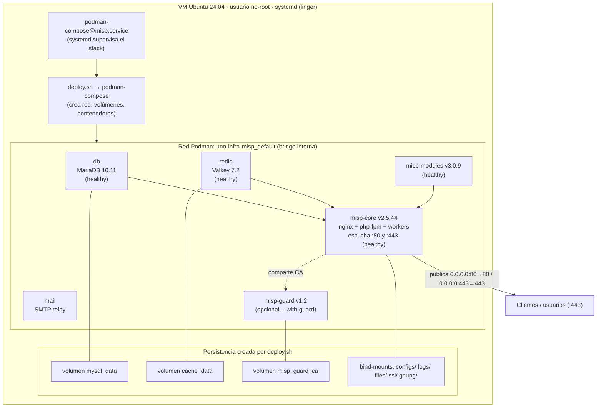
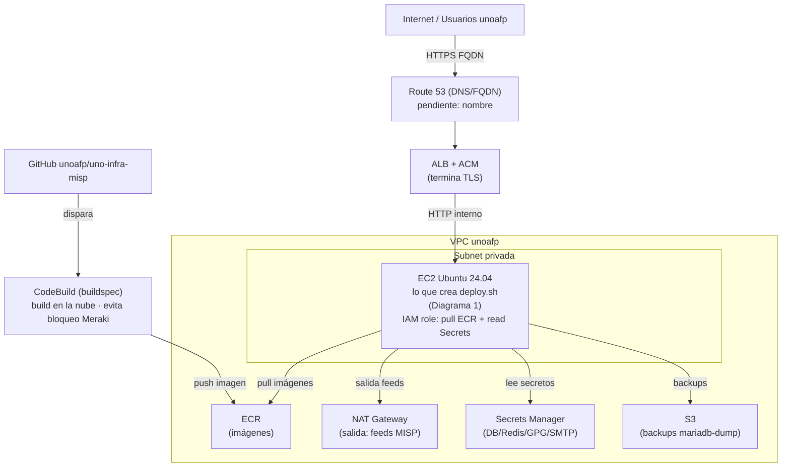

# Arquitectura del despliegue — MISP en AWS (Opción A: VM + Podman)

Este documento describe **qué crea `deploy.sh`** dentro de la VM y **cómo encaja** en la
infraestructura AWS de unoafp. Complementa a [`README.md`](./README.md) (uso operativo de
los scripts) y cierra la sección "Pendientes" del README raíz del repositorio.

## Alcance: qué crea `deploy.sh` y qué no

`deploy.sh` **no crea infraestructura AWS**. Crea y orquesta lo que corre *dentro* de la VM:
los contenedores, la red de Podman y los volúmenes. La infraestructura AWS de alrededor
(EC2, ALB, ECR, Secrets Manager, etc.) se aprovisiona por separado (Terraform / consola AWS).

| Capa | Quién la crea | Estado |
|---|---|---|
| Contenedores, red Podman, volúmenes, arranque systemd | **`provision.sh` + `deploy.sh`** | Construido y probado |
| EC2, ALB, ACM, ECR, Secrets Manager, S3, NAT, Route 53 | Terraform / consola AWS | Por crear |
| Build de imágenes en la nube | CodeBuild (`buildspec.yml`) | Por crear |

---

## Diagrama 1 — Lo que `deploy.sh` crea (dentro de la VM)

Alcance real y probado del script: contenedores **rootless** bajo Podman, una red bridge
interna, volúmenes y bind-mounts. Todo en una sola VM Ubuntu 24.04, supervisado por systemd.



### Versión ASCII (equivalente)

```
┌──────────────────────────────────────────────────────────────────────────┐
│  VM Ubuntu 24.04  (usuario no-root)                                        │
│  systemd (linger) ── supervisa ──► podman-compose@misp.service             │
│                                                                            │
│   deploy.sh  ──►  podman-compose  ──►  crea todo lo de abajo               │
│                                                                            │
│  ┌──────────────────────────────────────────────────────────────────┐    │
│  │  Red Podman:  uno-infra-misp_default  (bridge interna)            │    │
│  │                                                                    │    │
│  │   ┌────────────┐   ┌────────────┐   ┌──────────────┐              │    │
│  │   │    db      │   │   redis    │   │    mail      │              │    │
│  │   │ MariaDB    │   │  Valkey    │   │  SMTP relay  │              │    │
│  │   │ 10.11      │   │  7.2       │   │              │              │    │
│  │   │ (healthy)  │   │ (healthy)  │   │              │              │    │
│  │   └─────┬──────┘   └─────┬──────┘   └──────────────┘              │    │
│  │         │                │                                        │    │
│  │         │    ┌───────────────────┐                               │    │
│  │         │    │   misp-modules    │◄──── arranque escalonado:     │    │
│  │         │    │   v3.0.9 (healthy)│      1º modules → healthy      │    │
│  │         │    └─────────┬─────────┘                               │    │
│  │         ▼              ▼                                          │    │
│  │   ┌──────────────────────────────────┐                          │    │
│  │   │         misp-core  v2.5.44        │  2º core (depende de     │    │
│  │   │   nginx + php-fpm + workers       │     db/redis/modules     │    │
│  │   │   (healthy) · escucha :80 y :443  │     service_healthy)     │    │
│  │   └──────────────┬───────────────────┘                          │    │
│  │                  │                                               │    │
│  │   ┌──────────────────────────────┐  (opcional, --with-guard)    │    │
│  │   │       misp-guard  v1.2        │                              │    │
│  │   └──────────────────────────────┘                              │    │
│  └──────────────────┼───────────────────────────────────────────────┘    │
│                     │  publica puertos                                     │
│              0.0.0.0:80 → 80   /   0.0.0.0:443 → 443                        │
│                     │  (requiere ip_unprivileged_port_start=80)            │
│                                                                            │
│  Persistencia (creada por deploy.sh):                                      │
│   • Volumen podman:  mysql_data      → datos MariaDB                        │
│   • Volumen podman:  cache_data      → Redis/Valkey                         │
│   • Volumen podman:  misp_guard_ca   → CA compartida core↔guard             │
│   • Bind-mounts host: configs/  logs/  files/  ssl/  gnupg/                 │
└────────────────────────────┼───────────────────────────────────────────────┘
                              │  :443
                              ▼
                        Clientes / usuarios
```

### Puntos clave

- **5 contenedores** (6 con `--with-guard`), todos **rootless** bajo el usuario no-root.
- **1 red bridge interna** donde los servicios se resuelven por nombre (`db`, `redis`, `misp-core`...).
- **3 volúmenes Podman** + **5 bind-mounts** para persistencia y configuración.
- **Arranque escalonado**: primero `db`/`redis`/`mail`, luego `misp-modules` (espera a que
  esté *healthy*), luego `misp-core`. Esto resuelve el race de `depends_on: service_healthy`.
- Requiere el ajuste `net.ipv4.ip_unprivileged_port_start=80` (lo aplica `provision.sh`)
  para que Podman rootless pueda publicar 80/443.

---

## Diagrama 2 — Contexto AWS donde encaja (Opción A aterrizada)

La caja "lo que crea deploy.sh" es exactamente el Diagrama 1. Todo lo demás se aprovisiona
aparte (Terraform / consola).



### Versión ASCII (equivalente)

```
                            Internet / Usuarios unoafp
                                      │  HTTPS (FQDN)
                                      ▼
                        ┌──────────────────────────┐
                        │   Route 53  (DNS/FQDN)    │  ◄─ pendiente: nombre
                        └────────────┬─────────────┘
                                      │
                        ┌──────────────────────────┐
                        │  ALB  +  ACM (TLS)        │  ◄─ termina HTTPS
                        └────────────┬─────────────┘
                                      │ HTTP interno
┌──────────────────────── VPC unoafp ──────────────────────────────────────┐
│                                     │                                      │
│   Subnet privada          ┌─────────▼──────────────────────────────┐      │
│                           │   EC2  Ubuntu 24.04                     │      │
│                           │   ┌───────────────────────────────┐    │      │
│                           │   │  << lo que crea deploy.sh >>   │    │      │
│                           │   │  (Diagrama 1: 5 contenedores,  │    │      │
│                           │   │   red, volúmenes, systemd)     │    │      │
│                           │   └───────────────────────────────┘    │      │
│                           │   IAM role: pull ECR + read Secrets     │      │
│                           └───┬──────────────┬──────────────┬───────┘      │
│                               │              │              │              │
│   ┌──────────────┐   ┌──────────────┐   ┌──────────────────┐   ┌─────────┐│
│   │     ECR      │   │  NAT Gateway │   │ Secrets Manager  │   │   S3    ││
│   │ (imágenes)   │   │ (salida:     │   │ (DB/Redis/GPG/   │   │(backups ││
│   │              │   │  feeds MISP) │   │  SMTP secrets)   │   │ mariadb)││
│   └──────▲───────┘   └──────────────┘   └──────────────────┘   └─────────┘│
│          │ push imagen                                                     │
└──────────┼─────────────────────────────────────────────────────────────────┘
   ┌────────────────┐
   │   CodeBuild     │  ◄─ build en la nube (evita el bloqueo Meraki)
   │  (buildspec)    │      dispara desde GitHub (unoafp/uno-infra-misp)
   └────────────────┘
```

---

## Decisiones de infraestructura (Pendientes del README)

Estado de las definiciones para el ambiente AWS de unoafp:

| Pendiente | Decisión | Estado |
|---|---|---|
| **Cómputo** | EC2 Ubuntu 24.04 (misma versión validada en WSL) | Definido |
| **DNS / FQDN** | Nombre real por definir; `BASE_URL` parametrizable en `.env` (no bloquea) | Pendiente |
| **TLS** | ALB + ACM (TLS gestionado, renovación automática, sin autofirmados) | Propuesto |
| **Persistencia / respaldos** | Volúmenes en EBS + `mariadb-dump` diario a S3 | Propuesto |
| **Conectividad** | Entrada vía ALB; salida por NAT Gateway (feeds); pull de ECR interno | Propuesto |
| **Relay SMTP** | SES o relay corporativo (a confirmar). Variables `SES_*` / `SMARTHOST_*` en `.env` | Pendiente |
| **Gestión de secretos** | AWS Secrets Manager + IAM role (sin credenciales embebidas) | Definido |
| **Build / deploy** | ECR + CodeBuild + `deploy.sh`/systemd; disparo manual → luego SSM Run Command | Propuesto |

### Notas sobre las decisiones

- **Cómputo:** Ubuntu 24.04 replica el entorno donde se validó el stack de punta a punta;
  minimiza sorpresas de compatibilidad con Podman rootless.
- **TLS (ALB + ACM):** al correr todo en AWS, terminar TLS en el ALB con certificado ACM
  evita gestionar certbot/autofirmados y libera a la EC2 del tema de puertos privilegiados.
  Requiere el FQDN para emitir el certificado; se puede arrancar con DNS interno y añadir el
  certificado cuando el nombre esté definido.
- **Secretos:** los valores sensibles (passwords DB/Redis, `GPG_PASSPHRASE`, credenciales
  SMTP) se almacenan en Secrets Manager; al arrancar, la VM (con su IAM role) los lee y
  genera el `.env`. Nunca en claro en el repositorio ni en la imagen.
- **Build/deploy:** CodeBuild construye las imágenes en la red de AWS, lo que elimina el
  bloqueo intermitente del firewall Meraki observado en los builds locales. Las imágenes se
  publican en ECR y la EC2 hace `pull` por red interna. El deploy a la VM usa el
  `deploy.sh` + `systemd` de este directorio; se dispara manualmente al inicio y puede
  automatizarse con SSM Run Command sin necesidad de un pipeline completo.

---

## Referencias

- Uso operativo de los scripts: [`README.md`](./README.md)
- Script de aprovisionamiento de la VM: [`provision.sh`](./provision.sh)
- Script de despliegue del stack: [`deploy.sh`](./deploy.sh)
- Unit de systemd (supervisor del stack): [`misp.service`](./misp.service)
